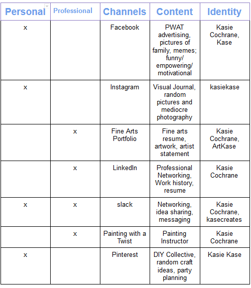
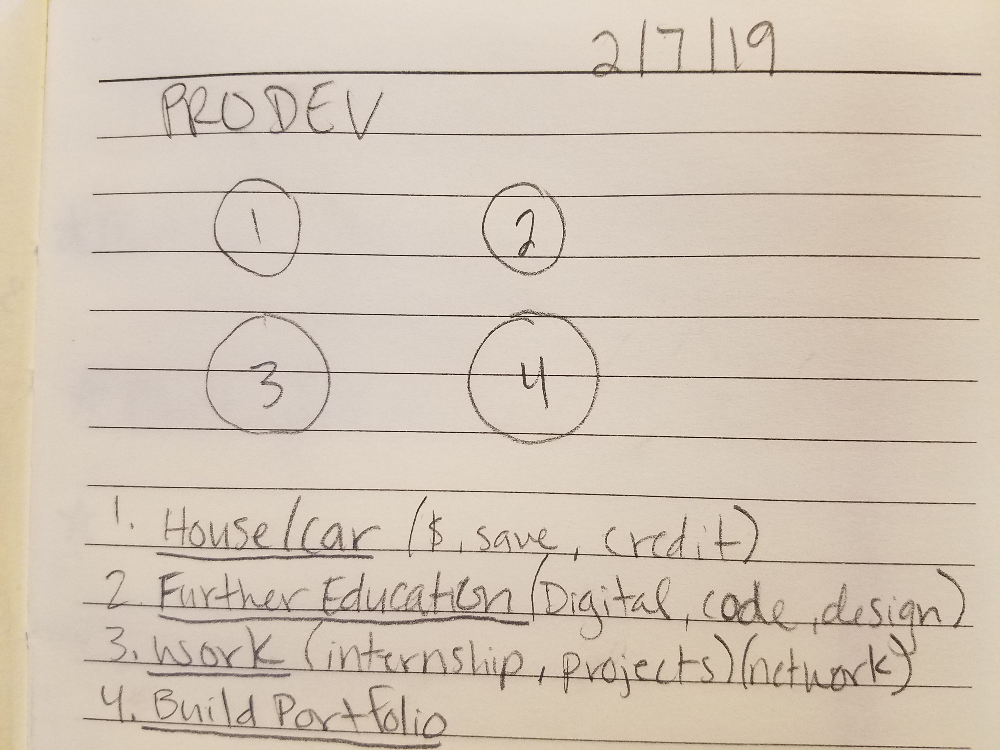

<!DOCTYPE html>
<html lang="en">
  
<head>
  <link href="style.css" rel="stylesheet">   
</head>
<body>  
<h1>
Kasie Cochrane's
 
 Professional Development 
</h1>
  
Last updated February 5, 2018   Career Buddy: Sergio Rivera
  
 <h2>
  My Links
  </h2>
 <li>
  <a href="http://www.artkase.com"> Art Page </a>
   </li>

<li>
 <a href="http://www.linkedin.com/in/kasiecochrane315"> LinkedIn </a>
  </li>
  
  <li>
  <a href="resume-2018.pdf"> Resume </a>
  </li> 
  
  <h3>
  Learning Style
  </h3>
 Auditory: 40%  
 Visual: 50%  
 Tactile: 10%  
 
 <h2>
  ProDev Activities
  </h2>
  
  <h2>
  Week One
  </h2>
<h3>
  Quantitative Accomplishments
  </h3>
1. Successfully raised a daughter for the last 7 years. 
2. Experimented with more than 10 art mediums. 
3. Worked a total of 12 years building soft skills.

<h3>
  Qualitative Features
  </h3>
1. Possitive but misconceived  
2. Creative yet an overthinker  
3. Diligent but sometimes confound

<h3>
  Whole Brain Paragraph
  </h3>
When I start an art project I set up all the components I need for the task so I can configure the time needed. Once I have an idea of the direction I want to go in, I have to be sure that my vision is obtainable. After that the creative process can start. I may hit obsticals and I will have to reason with myself by making changes to different aspects of the desired piece and work towards a realistic goal.

<h3>
  Golden Circle
  </h3>
Why?   I enjoy bringing happiness to others through sharing creativity and artistry skills.  

How?   I want to design something that will influence imagination and creativity and allow that to be easily obtainable.  

What?   I am an aspiring digital media artist that will focus on inovative ways to help people get creative.

<h3>
  Elevator Pitch
  </h3>
Hi, my name is Kasie Cochrane. I am a digital media artist focusing on innovative ways to help people get creative. I feel it is important to bring joy and happiness to others through the process of creating. I want to work on a way to make "getting creative" realistic for all. Do you have any thoughts on that?
<body/>

<h3>
  Week One Reflection
  </h3>
Throughout the first week of the Digital Media bootcamp I designed a boared game with a group of talented people. I have realized that it is very benificial to have a diverse group of minds working on a project because of the different life experience and new ideas they bring to the table. Being the only female in the group I feel I have somewhat of a responsibility to work even harder and stive to learn and take in as much as I can during the bootcamp. I only hope I can meet my own expectations.

<h2>
  Week Two
  </h2>
  
  <h3>
  Visuals Speak
  </h3>

   
 The duck image is symbolizing myself as I go with the flow of things, unconfidently. I am more or less testing out the waters. The image of the woman has more of a demeanor and purpose. In three years, or so, I hope to be more comfortable with myself and I hope it shows. When it comes to my professionalism, instead of ridding myself of negativity or failure, may I continue to grow though everything I do and build on each experience.
 
 <h3>
  Activity Chart
  </h3>
  
   
 <h3>
  Summary
  </h3>
  Just looking at my online activity I would say that a recruiter will get that I am generally unexciting. I have the basic set up of social media and a few professional connections. I also do not have much of a tech portfolio because it is more of a fine arts background. The recruiter may take a chance on me since I am at the beginning of a digital media feild.  
  
 <h3>
   Week Two Reflection
  </h3>
  During week two I stared making a commercial with the program Vyond. I really enjoyed the proccess and my final commercial came out very well. Although Vyond is limited on what can be done in the program I feel I definately learned a lot about story boarding, animation and scene development. My next venture is with Unity, a video game developing program. I am nervous for that one because I have heard of how challenging it can be. I will need to watch a ton of tutorials and research some techniques but I have no doubt that I can do this. I think that everything we are doing here in this bootcamp not only teaches us about the awesome programs we use but I realize how much work I have to do on my own, given that we have copius amounts of resources to use to get us where we want to be.
  
  <h2>
  Week Three
  </h2>
  <h3>
  Cooking Up Opportunity
  </h3>
  
   
  <h3>
  Two Orgs
  </h3>
  
<li>
  <a href="https://ideum.com/about/team"> Ideum </a>
  </li>
  
<li>
  <a href="https://jobs.meowwolf.com/"> Meow Wolf </a>
  </li>
  
<h3>
  Week Three Reflection
  </h3>
  Week three was getting projects started that I am interested in and as well as video game building with Unity. In unity I used a packaged game I was able to download and create my own levels with using the pre-coded sprites. I created a maze game with many dead ends and obsticals to throw off the player. There were pre-coded enemies I was able to utilize to challenge the players, as well. My sister, brother-in-law and daughter tested my game and were equally impressed and entertained. I began and continued many projects in week three, such as digital artwork for signage to be put up at the CNM Rio Rancho campus and a audio visualization interactive display for Explora, as well as helping other digital media students on some of their projects. I feel we are getting into the good stuff as we go into week four. I am prepared to be challenged and look forward to learning about some cool software I can use to further my experience.
 </body>
</html>
